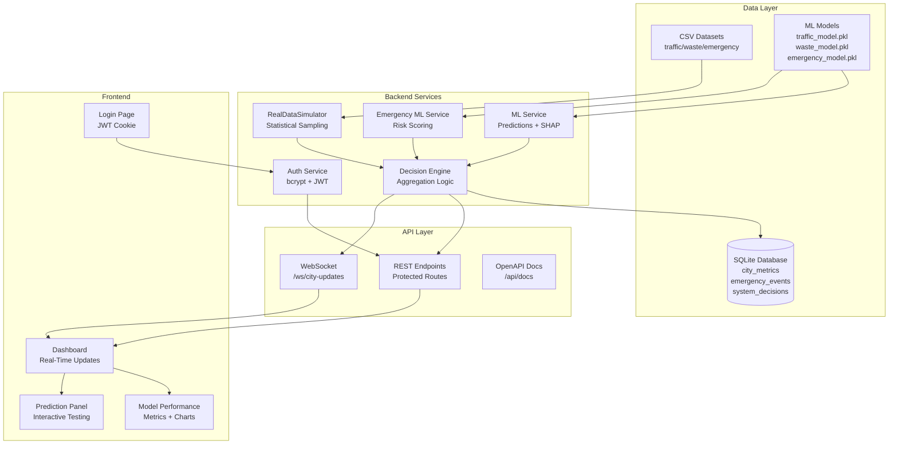

# Smart City Production Upgrade - Design Document

## Overview

This design transforms the Smart City hackathon prototype into a production-ready system. The upgrade focuses on ten critical areas: ML pipeline reproducibility, real data integration, emergency prediction service, secure authentication, database persistence, API security, real-time WebSocket communication, enhanced frontend features, comprehensive documentation, and Docker deployment.

The current system uses random simulation and fake authentication. The upgraded system will use trained ML models with real data sampling, bcrypt/JWT authentication, SQLite persistence, WebSocket broadcasting, and containerized deployment.

### Key Design Principles

- **Data Authenticity**: Replace random.uniform() with statistical sampling from real CSV data
- **Security First**: Implement proper bcrypt hashing, JWT tokens, RBAC, and rate limiting
- **Persistence**: Move from in-memory to SQLite for all historical data
- **Real-Time**: Replace polling with WebSocket for instant updates
- **Reproducibility**: Jupyter notebook pipeline for model training and evaluation
- **Production Ready**: Docker containers, environment configuration, health checks

## Architecture

### System Architecture



### Data Flow

1. **Startup**: Load CSV files → Train/Load ML models → Initialize SQLite → Start simulation loop
2. **Simulation Tick** (every 5s): Sample from real data → Update city state → Persist to DB → Broadcast via WebSocket
3. **Decision Generation**: Aggregate state → Run ML predictions → Generate SHAP explanations → Calculate ROI → Persist decision
4. **Client Request**: Authenticate JWT → Check RBAC → Execute endpoint → Return response
5. **Real-Time Update**: WebSocket connection → Receive broadcast → Update React state → Re-render dashboard

### Technology Stack

**Backend:**
- FastAPI (async web framework)
- SQLAlchemy + Alembic (ORM + migrations)
- passlib[bcrypt] (password hashing)
- python-jose[cryptography] (JWT tokens)
- slowapi (rate limiting)
- scikit-learn, XGBoost (ML models)
- SHAP (explainability)
- pandas, numpy (data processing)

**Frontend:**
- Next.js 16 (React 19)
- Tailwind CSS (styling)
- axios (HTTP client with interceptors)
- recharts (data visualization)
- lucide-react (icons)

**Infrastructure:**
- Docker + docker-compose
- SQLite (embedded database)
- WebSocket (real-time communication)

## Components and Interfaces

### 1. ML Training Pipeline (Jupyter Notebook)

**File:** `notebooks/train_models.ipynb`

**Purpose:** Reproducible pipeline for training and evaluating ML models

**Structure:**
```python
# Cell 1: Imports and Setup
import pandas as pd
import numpy as np
from sklearn.ensemble import RandomForestClassifier, GradientBoostingClassifier
from xgboost import XGBClassifier
from sklearn.model_selection import train_test_split, StratifiedKFold, cross_val_score
from sklearn.preprocessing import StandardScaler, LabelEncoder
from sklearn.metrics import classification_report, confusion_matrix, roc_auc_score
import matplotlib.pyplot as plt
import seaborn as sns
import joblib

# Cell 2: Load Data
traffic_df = pd.read_csv('../data/traffic_clean.csv')
waste_df = pd.read_csv('../data/waste_clean.csv')
emergency_df = pd.read_csv('../data/emergency_clean.csv')

# Cell 3-5: EDA (shape, nulls, describe, correlation heatmaps)
# Cell 6-8: Preprocessing (encoding, scaling, split)
# Cell 9-14: Train traffic models (RF, GB, XGB)
# Cell 15-20: Train waste models (RF, GB, XGB)
# Cell 21-26: Train emergency model
# Cell 27-29: Save best models and feature importance plots
```

**Key Functions:**
- `train_and_evaluate(X, y, model_name)`: Trains model with cross-validation
- `plot_feature_importance(model, feature_names, filename)`: Saves importance plot
- `select_best_model(results)`: Compares cross-validation scores

**Outputs:**
- `traffic_model.pkl`: Best traffic congestion classifier
- `waste_model.pkl`: Best waste overflow classifier
- `emergency_model.pkl`: Emergency risk classifier
- `notebooks/plots/*.png`: Feature importance visualizations

### 2. RealDataSimulator Class

**File:** `api/services/simulation_service.py`

**Purpose:** Generate realistic city state by sampling from actual CSV data

**Class Design:**
```python
class RealDataSimulator:
    def __init__(self):
        self.traffic_data: pd.DataFrame = None
        self.waste_data: pd.DataFrame = None
        self.emergency_data: pd.DataFrame = None
        self.data_source: str = "statistical_sim"
        self.location_windows: dict = {}  # Rolling windows per location
        self.current_hour: int = datetime.now().hour
        
    def load_datasets(self) -> bool:
        """Load CSV files, return True if successful"""
        
    def sample_traffic_for_location(self, location_id: int, hour: int) -> float:
        """Sample traffic level weighted by time of day"""
        
    def sample_waste_for_location(self, location_id: int) -> float:
        """Sample waste level using actual progression rates"""
        
    def update_city_state(self) -> dict:
        """Generate new city state from real data distributions"""
        
    def get_current_state(self) -> dict:
        """Return current city state"""
```

**State Structure:**
```python
{
    "traffic_levels": {1: 0.75, 2: 0.45, ...},  # 10 locations
    "waste_levels": {1: 0.82, 2: 0.34, ...},    # 10 locations
    "emergencies": [EmergencyEvent, ...],
    "data_source": "real_data" | "statistical_sim",
    "weather_enc": int
}
```

**Sampling Strategy:**
- Traffic: Filter by hour ± 1, sample from matching rows, apply temporal smoothing
- Waste: Use bin_fill_pct distribution, apply incremental progression based on last_collection_days
- Emergency: Probabilistic sampling weighted by hour and weather conditions

### 3. Emergency ML Service

**File:** `api/services/emergency_ml_service.py`

**Purpose:** Predict emergency risk using trained ML model with SHAP explainability

**Interface:**
```python
def load_emergency_model() -> None:
    """Load emergency_model.pkl at startup"""

def predict_emergency_risk(
    zone: int,
    hour: int,
    day_of_week: int,
    weather: int,
    road_condition: int
) -> dict:
    """
    Returns:
    {
        "risk_score": float,      # 0.0 to 5.0
        "high_risk": bool,        # True if risk_score > 3.0
        "confidence": float,      # Model confidence 0.0 to 1.0
        "prediction": int         # 0 or 1
    }
    """

def explain_emergency_prediction(
    features: dict,
    risk_score: float,
    prediction: int
) -> ModelExplainability:
    """Generate SHAP explanation for emergency prediction"""
```

**Fallback Logic:**
- If model not loaded: Use rule-based scoring (hour + weather + road_condition weights)
- If SHAP fails: Return generic explanation with feature values

### 4. Authentication System

**File:** `api/utils/auth.py`

**Purpose:** Secure authentication with bcrypt and JWT

**Key Functions:**
```python
def get_password_hash(password: str) -> str:
    """Hash password using bcrypt with automatic salt"""
    # Uses passlib.hash.bcrypt.hash()

def verify_password(plain_password: str, hashed_password: str) -> bool:
    """Verify password against bcrypt hash"""
    # Uses passlib.hash.bcrypt.verify()

def create_access_token(data: dict, expires_delta: timedelta = None) -> str:
    """Create JWT token with expiry"""
    # Uses jose.jwt.encode() with HS256

def create_refresh_token(data: dict) -> str:
    """Create long-lived refresh token (7 days)"""

async def get_current_user(token: str = Depends(oauth2_scheme)) -> dict:
    """Validate JWT and return user data"""
    # Raises HTTPException(401) if invalid

def require_role(required_role: str):
    """Dependency for role-based access control"""
    # Returns dependency function that checks user role
```

**User Database:**
```python
# In-memory for demo (can be moved to SQLite)
USERS_DB = {
    "admin": {
        "username": "admin",
        "hashed_password": bcrypt_hash("admin123"),
        "role": "admin"
    },
    "viewer": {
        "username": "viewer",
        "hashed_password": bcrypt_hash("viewer123"),
        "role": "viewer"
    }
}
```

**JWT Payload:**
```python
{
    "sub": "username",
    "role": "admin" | "viewer",
    "exp": timestamp
}
```

### 5. Database Schema

**File:** `api/db/database.py`

**Purpose:** SQLite persistence with SQLAlchemy ORM

**Models:**
```python
class CityMetric(Base):
    __tablename__ = "city_metrics"
    
    id = Column(Integer, primary_key=True, index=True)
    timestamp = Column(DateTime, default=datetime.utcnow, index=True)
    location_id = Column(Integer, index=True)
    traffic_level = Column(Float)
    waste_level = Column(Float)
    data_source = Column(String)  # "real_data" or "statistical_sim"

class EmergencyEvent(Base):
    __tablename__ = "emergency_events"
    
    id = Column(Integer, primary_key=True, index=True)
    timestamp = Column(DateTime, default=datetime.utcnow, index=True)
    zone = Column(Integer, index=True)
    risk_score = Column(Float)
    high_risk = Column(Boolean)
    event_type = Column(String)
    severity = Column(String)

class SystemDecision(Base):
    __tablename__ = "system_decisions"
    
    id = Column(Integer, primary_key=True, index=True)
    timestamp = Column(DateTime, default=datetime.utcnow, index=True)
    city_health_score = Column(Float)
    max_traffic = Column(Float)
    max_waste = Column(Float)
    actions_json = Column(Text)  # JSON array of action strings
    data_source = Column(String)
```

**Database Operations:**
```python
def init_db():
    """Create all tables"""
    Base.metadata.create_all(bind=engine)

def get_db():
    """Dependency for database sessions"""
    db = SessionLocal()
    try:
        yield db
    finally:
        db.close()

def persist_city_metrics(state: dict, db: Session):
    """Save current city state to database"""

def persist_decision(decision: DecisionResponse, db: Session):
    """Save decision to database"""

def query_history(
    db: Session,
    limit: int = 100,
    start: datetime = None,
    end: datetime = None
) -> List[CityMetric]:
    """Query historical metrics with filters"""
```

**Alembic Setup:**
- `alembic init alembic` to create migration structure
- `alembic/env.py` configured to use SQLAlchemy models
- Initial migration: `alembic revision --autogenerate -m "Initial schema"`
- Apply migrations: `alembic upgrade head`

### 6. Protected API Routes

**File:** `api/routes/*.py`

**Purpose:** Apply authentication and authorization to sensitive endpoints

**Protection Strategy:**
```python
# Public endpoints (no auth required)
GET /health
GET /api/data-sources
POST /auth/token
GET /api/docs

# Viewer role required
GET /system/decision
GET /history/trends
GET /history/full
GET /map-data
GET /models/stats

# Admin role required
POST /predict/traffic
POST /predict/waste
POST /explain/traffic
POST /explain/waste
POST /emergency/trigger  # If added
```

**Implementation Pattern:**
```python
from api.utils.auth import get_current_user, require_role

@router.post("/predict/traffic")
async def predict_traffic(
    req: TrafficPredictionRequest,
    current_user: dict = Depends(require_role("admin"))
):
    # Only admins can trigger predictions
    ...
```

### 7. WebSocket Architecture

**File:** `api/routes/ws.py`

**Purpose:** Real-time city state broadcasting to connected clients

**Design:**
```python
from fastapi import WebSocket, WebSocketDisconnect
from typing import List

class ConnectionManager:
    def __init__(self):
        self.active_connections: List[WebSocket] = []
    
    async def connect(self, websocket: WebSocket):
        await websocket.accept()
        self.active_connections.append(websocket)
    
    def disconnect(self, websocket: WebSocket):
        self.active_connections.remove(websocket)
    
    async def broadcast(self, message: dict):
        for connection in self.active_connections:
            try:
                await connection.send_json(message)
            except:
                # Handle disconnected clients
                pass

manager = ConnectionManager()

@router.websocket("/ws/city-updates")
async def websocket_endpoint(websocket: WebSocket):
    await manager.connect(websocket)
    try:
        while True:
            # Keep connection alive, wait for client messages
            await websocket.receive_text()
    except WebSocketDisconnect:
        manager.disconnect(websocket)
```

**Broadcasting Integration:**
- Modify `simulation_service.py` to call `manager.broadcast()` after each state update
- Broadcast payload includes full DecisionResponse
- Frontend receives updates and updates React state

### 8. Frontend Authentication Flow

**Files:** 
- `frontend/src/app/login/page.tsx` (new)
- `frontend/src/app/api/auth/[...nextauth]/route.ts` (new)
- `frontend/src/lib/axios.ts` (new)

**Login Page Design:**
```tsx
// login/page.tsx
export default function LoginPage() {
  const [username, setUsername] = useState("");
  const [password, setPassword] = useState("");
  const router = useRouter();
  
  const handleLogin = async (e) => {
    e.preventDefault();
    const response = await fetch("/api/auth/login", {
      method: "POST",
      headers: { "Content-Type": "application/json" },
      body: JSON.stringify({ username, password })
    });
    
    if (response.ok) {
      router.push("/");
    } else {
      // Show error
    }
  };
  
  return (
    <form onSubmit={handleLogin}>
      {/* Username and password inputs */}
    </form>
  );
}
```

**Next.js API Route for Token Storage:**
```tsx
// app/api/auth/login/route.ts
export async function POST(request: Request) {
  const { username, password } = await request.json();
  
  // Call backend /auth/token
  const response = await fetch(`${process.env.BACKEND_URL}/auth/token`, {
    method: "POST",
    headers: { "Content-Type": "application/x-www-form-urlencoded" },
    body: new URLSearchParams({ username, password })
  });
  
  if (response.ok) {
    const { access_token } = await response.json();
    
    // Set httpOnly cookie
    const headers = new Headers();
    headers.append("Set-Cookie", `token=${access_token}; HttpOnly; Path=/; Max-Age=1800`);
    
    return new Response(JSON.stringify({ success: true }), { headers });
  }
  
  return new Response(JSON.stringify({ error: "Invalid credentials" }), { status: 401 });
}
```

**Axios Interceptor:**
```tsx
// lib/axios.ts
import axios from "axios";

const api = axios.create({
  baseURL: process.env.NEXT_PUBLIC_API_URL || "http://localhost:8000"
});

api.interceptors.request.use((config) => {
  // Token is in httpOnly cookie, browser sends automatically
  // For explicit Bearer token, read from cookie via API route
  return config;
});

api.interceptors.response.use(
  (response) => response,
  (error) => {
    if (error.response?.status === 401) {
      window.location.href = "/login";
    }
    return Promise.reject(error);
  }
);

export default api;
```

### 9. Enhanced Frontend Components

#### Model Performance Dashboard

**File:** `frontend/src/app/model-stats/page.tsx`

**Purpose:** Display ML model metrics and visualizations

**Layout:**
```tsx
<div className="grid grid-cols-1 lg:grid-cols-3 gap-6">
  {/* Traffic Model Card */}
  <ModelCard
    title="Traffic Congestion Model"
    metrics={{ accuracy: 0.89, precision: 0.87, recall: 0.91, f1: 0.89 }}
    featureImportance={[...]}
    confusionMatrix={[[tp, fp], [fn, tn]]}
  />
  
  {/* Waste Model Card */}
  <ModelCard
    title="Waste Overflow Model"
    metrics={{ accuracy: 0.92, precision: 0.90, recall: 0.94, f1: 0.92 }}
    featureImportance={[...]}
    confusionMatrix={[[tp, fp], [fn, tn]]}
  />
  
  {/* Emergency Model Card */}
  <ModelCard
    title="Emergency Risk Model"
    metrics={{ accuracy: 0.85, precision: 0.83, recall: 0.87, f1: 0.85 }}
    featureImportance={[...]}
    confusionMatrix={[[tp, fp], [fn, tn]]}
  />
</div>
```

**Data Source:** `GET /api/models/stats` endpoint that reads metrics from saved JSON or calculates from test set

#### Enhanced KPI Card

**File:** `frontend/src/components/KPICard.tsx`

**Enhancements:**
```tsx
interface KPICardProps {
  title: string;
  value: string;
  statusText: string;
  statusLevel: string;
  icon: ReactNode;
  history?: number[];  // Last 10 readings for sparkline
  threshold?: number;  // Pulse animation if exceeded
  apiPath?: string;
  features?: any;
}

export default function KPICard({ title, value, history, threshold, ... }: KPICardProps) {
  const [expanded, setExpanded] = useState(false);
  const numericValue = parseFloat(value);
  const exceedsThreshold = threshold && numericValue > threshold;
  
  return (
    <div 
      className={`glass-panel cursor-pointer ${exceedsThreshold && 'animate-pulse-border'}`}
      onClick={() => setExpanded(!expanded)}
    >
      {/* Compact view with sparkline */}
      {!expanded && history && (
        <Sparkline data={history} width={100} height={30} />
      )}
      
      {/* Expanded view with full chart */}
      {expanded && (
        <LineChart data={fullHistory} />
      )}
    </div>
  );
}
```

#### Interactive Prediction Panel

**File:** `frontend/src/components/PredictionPanel.tsx`

**Purpose:** Allow manual parameter input for live ML predictions

**Design:**
```tsx
export default function PredictionPanel() {
  const [predictionType, setPredictionType] = useState<"traffic" | "waste">("traffic");
  const [params, setParams] = useState({});
  const [result, setResult] = useState(null);
  const [explanation, setExplanation] = useState(null);
  
  const handlePredict = async () => {
    const response = await api.post(`/api/predict/${predictionType}`, params);
    setResult(response.data);
    
    // Automatically fetch explanation
    const explainResponse = await api.post(`/api/explain/${predictionType}`, params);
    setExplanation(explainResponse.data);
  };
  
  return (
    <div className="glass-panel p-6">
      <TabSelector value={predictionType} onChange={setPredictionType} />
      
      {predictionType === "traffic" && (
        <TrafficForm params={params} onChange={setParams} />
      )}
      
      {predictionType === "waste" && (
        <WasteForm params={params} onChange={setParams} />
      )}
      
      <button onClick={handlePredict}>Predict</button>
      
      {result && <PredictionResult data={result} />}
      {explanation && <SHAPExplanation data={explanation} />}
    </div>
  );
}
```

### 10. Docker Configuration

**File:** `Dockerfile`

**Purpose:** Containerize backend application

**Multi-stage Build:**
```dockerfile
FROM python:3.11-slim as base

WORKDIR /app

# Install dependencies
COPY requirements.txt .
RUN pip install --no-cache-dir -r requirements.txt

# Copy application
COPY api/ ./api/
COPY data/ ./data/
COPY *.pkl ./

# Expose port
EXPOSE 8000

# Run application
CMD ["uvicorn", "api.main:app", "--host", "0.0.0.0", "--port", "8000"]
```

**File:** `docker-compose.yml`

**Purpose:** Orchestrate backend and frontend services

```yaml
version: '3.8'

services:
  backend:
    build: .
    ports:
      - "8000:8000"
    environment:
      - SECRET_KEY=${SECRET_KEY}
      - ALLOWED_ORIGINS=http://localhost:3000
      - DATABASE_URL=sqlite:///./data/history.db
    volumes:
      - ./data:/app/data
    healthcheck:
      test: ["CMD", "curl", "-f", "http://localhost:8000/health"]
      interval: 30s
      timeout: 10s
      retries: 3

  frontend:
    build: ./frontend
    ports:
      - "3000:3000"
    environment:
      - NEXT_PUBLIC_API_URL=http://localhost:8000
    depends_on:
      - backend
```

## Data Models

### Request Models

**TrafficPredictionRequest:**
```python
{
    "hour": int,              # 0-23
    "day_enc": int,           # 0-6 (Monday=0)
    "junction_enc": int,      # 0-9 (junction ID)
    "weather_enc": int,       # 0-3 (clear, rain, fog, storm)
    "vehicles": int           # Vehicle count
}
```

**WastePredictionRequest:**
```python
{
    "area": int,                    # 0-9 (area ID)
    "day_of_week": int,             # 0-6
    "population_density": float,    # People per sq km
    "last_collection_days": int,    # Days since last collection
    "bin_fill_pct": float           # 0.0 to 100.0
}
```

**EmergencyRiskRequest:**
```python
{
    "zone": int,              # 0-9
    "hour": int,              # 0-23
    "day_of_week": int,       # 0-6
    "weather": int,           # 0-3
    "road_condition": int     # 0-2 (good, moderate, poor)
}
```

### Response Models

**ModelExplainability:**
```python
{
    "prediction": str,        # "High" or "Low"
    "confidence": float,      # 0.0 to 1.0
    "top_features": [
        {
            "feature": str,
            "display_name": str,
            "value": float,
            "impact": float,
            "effect": str  # "increases" or "decreases"
        }
    ],
    "explanation": str        # Human-readable summary
}
```

**DecisionResponse (Enhanced):**
```python
{
    "traffic": {
        "value": float,
        "status": str,
        "features": TrafficPredictionRequest,
        "explainability": ModelExplainability
    },
    "waste": {
        "value": float,
        "risk": str,
        "features": WastePredictionRequest,
        "explainability": ModelExplainability,
        "waste_overflow_eta": str
    },
    "emergency": {
        "type": str,
        "severity": str,
        "worst_zone": int,
        "risk_score": float,
        "explainability": ModelExplainability
    },
    "alerts": List[str],
    "actions": List[str],
    "data_source": str,
    "roi": ROIData,
    "city_health_score": float
}
```

### Database Models

See Section 5 (Database Schema) for SQLAlchemy model definitions.

### Configuration Models

**Environment Variables (Backend):**
```python
SECRET_KEY: str              # JWT signing key (min 32 chars)
ALGORITHM: str = "HS256"     # JWT algorithm
ACCESS_TOKEN_EXPIRE_MINUTES: int = 30
REFRESH_TOKEN_EXPIRE_DAYS: int = 7
ALLOWED_ORIGINS: str         # Comma-separated list
DATABASE_URL: str = "sqlite:///./data/history.db"
RATE_LIMIT: str = "60/minute"
```

**Environment Variables (Frontend):**
```python
NEXT_PUBLIC_API_URL: str     # Backend URL
NEXT_PUBLIC_WS_URL: str      # WebSocket URL
```


## Correctness Properties

*A property is a characteristic or behavior that should hold true across all valid executions of a system—essentially, a formal statement about what the system should do. Properties serve as the bridge between human-readable specifications and machine-verifiable correctness guarantees.*

### Property 1: Real data sampling bounds

*For any* city state generated by RealDataSimulator, all traffic and waste level values should be within the min/max bounds of the original CSV data.

**Validates: Requirements 2.2**

### Property 2: Time-weighted traffic sampling

*For any* two time periods (rush hour vs midnight), the distribution of sampled traffic values should differ significantly, reflecting the time-of-day patterns in the CSV data.

**Validates: Requirements 2.3**

### Property 3: Waste progression realism

*For any* sequence of waste level updates for a location, the rate of increase should be within the range of bin_fill_pct progression rates observed in the CSV data.

**Validates: Requirements 2.4**

### Property 4: Data source field presence

*For any* city state returned by get_current_state(), the state dictionary should contain a "data_source" field with value "real_data" or "statistical_sim".

**Validates: Requirements 2.6**

### Property 5: Rolling window size constraint

*For any* location after 100 state updates, the rolling window should contain at most 50 samples.

**Validates: Requirements 2.7**

### Property 6: Emergency prediction structure

*For any* valid emergency risk prediction input, the output should contain "risk_score" (float), "high_risk" (bool), and "confidence" (float) keys.

**Validates: Requirements 3.3**

### Property 7: SHAP explanation completeness

*For any* emergency prediction with loaded model, the SHAP explanation should contain a non-empty "top_features" list.

**Validates: Requirements 3.5**

### Property 8: Bcrypt hash format

*For any* password hashed by get_password_hash(), the resulting string should start with "$2b$" (bcrypt identifier).

**Validates: Requirements 4.1**

### Property 9: JWT expiry presence

*For any* JWT token created by create_access_token(), decoding the token should reveal an "exp" (expiry) claim.

**Validates: Requirements 4.3**

### Property 10: JWT expiry validation

*For any* expired JWT token, calling get_current_user() should raise HTTPException with status 401.

**Validates: Requirements 4.4**

### Property 11: Protected endpoint authentication

*For any* protected endpoint (prediction, explain), making a request without a valid JWT token should return HTTP 401.

**Validates: Requirements 5.1, 5.2, 5.4**

### Property 12: Authorization failure response

*For any* admin-only endpoint, making a request with a viewer role token should return HTTP 403.

**Validates: Requirements 5.5**

### Property 13: Database persistence

*For any* state update or decision generated, a corresponding record should be created in the database (city_metrics or system_decisions table).

**Validates: Requirements 6.3, 6.4**

### Property 14: History query filtering

*For any* history query with date range filters (start, end), all returned records should have timestamps within the specified range (inclusive).

**Validates: Requirements 7.2**

### Property 15: History query limit

*For any* history query with a limit parameter, the number of returned records should be less than or equal to the specified limit.

**Validates: Requirements 7.3**

### Property 16: API request authentication

*For any* API request made through the axios client after login, the request should include an Authorization header with Bearer token.

**Validates: Requirements 10.3**

### Property 17: Cross-validation fold count

*For any* model trained with StratifiedKFold(n_splits=5), the cross-validation should return exactly 5 scores.

**Validates: Requirements 1.5**

## Error Handling

### ML Model Loading Errors

**Scenario:** Model .pkl files not found or corrupted

**Handling:**
- Log warning message with file path
- Set model variable to None
- Use fallback prediction logic (rule-based or statistical)
- Return predictions with lower confidence scores
- Include "model_status": "fallback" in responses

**Example:**
```python
try:
    _traffic_model = joblib.load('traffic_model.pkl')
except Exception as e:
    logger.warning(f"Failed to load traffic model: {e}")
    _traffic_model = None
```

### CSV Data Loading Errors

**Scenario:** CSV files missing or malformed

**Handling:**
- Log error with file path and exception details
- Set data_source to "statistical_sim"
- Generate synthetic data using statistical distributions
- Continue operation without crashing
- Expose data_source in API responses so clients know

**Example:**
```python
try:
    self.traffic_data = pd.read_csv('../data/traffic_clean.csv')
    self.data_source = "real_data"
except Exception as e:
    logger.error(f"Failed to load CSV: {e}")
    self.data_source = "statistical_sim"
    # Use random.uniform() as fallback
```

### Authentication Errors

**Scenario:** Invalid credentials, expired tokens, missing tokens

**Handling:**
- Return HTTP 401 for authentication failures
- Return HTTP 403 for authorization failures
- Include WWW-Authenticate header in 401 responses
- Provide clear error messages in response body
- Frontend redirects to /login on 401

**Example:**
```python
credentials_exception = HTTPException(
    status_code=status.HTTP_401_UNAUTHORIZED,
    detail="Could not validate credentials",
    headers={"WWW-Authenticate": "Bearer"},
)
```

### Database Errors

**Scenario:** Database connection failures, query errors, constraint violations

**Handling:**
- Wrap all database operations in try-except blocks
- Log errors with full stack trace
- Return HTTP 500 with generic error message (don't expose internals)
- For read failures: return empty results or cached data
- For write failures: log but continue operation (don't block real-time updates)

**Example:**
```python
try:
    db.add(metric)
    db.commit()
except Exception as e:
    logger.error(f"Failed to persist metric: {e}")
    db.rollback()
    # Continue without crashing
```

### WebSocket Errors

**Scenario:** Client disconnections, broadcast failures, connection timeouts

**Handling:**
- Catch WebSocketDisconnect exceptions
- Remove disconnected clients from active connections list
- Continue broadcasting to remaining clients
- Log connection/disconnection events
- Frontend automatically attempts reconnection

**Example:**
```python
async def broadcast(self, message: dict):
    disconnected = []
    for connection in self.active_connections:
        try:
            await connection.send_json(message)
        except Exception as e:
            logger.warning(f"Broadcast failed: {e}")
            disconnected.append(connection)
    
    # Clean up disconnected clients
    for conn in disconnected:
        self.active_connections.remove(conn)
```

### Rate Limiting Errors

**Scenario:** Client exceeds rate limit (60 requests/minute)

**Handling:**
- Return HTTP 429 Too Many Requests
- Include Retry-After header with seconds to wait
- Log rate limit violations with IP address
- Frontend displays user-friendly message

**Example:**
```python
from slowapi import Limiter
from slowapi.util import get_remote_address

limiter = Limiter(key_func=get_remote_address)

@app.get("/api/system/decision")
@limiter.limit("60/minute")
async def get_decision():
    # Rate limited to 60 requests per minute per IP
    ...
```

### Frontend Error Boundaries

**Scenario:** Component rendering errors, API failures, WebSocket disconnections

**Handling:**
- Wrap major sections in ErrorBoundary components
- Display fallback UI with error message
- Log errors to console for debugging
- Provide retry button where appropriate
- Show connection status in navbar

**Example:**
```tsx
<ErrorBoundary fallbackText="Decision Panel Error">
  <DecisionPanel actions={data?.actions || []} />
</ErrorBoundary>
```

## Testing Strategy

### Dual Testing Approach

This project requires both unit testing and property-based testing for comprehensive coverage:

- **Unit tests**: Verify specific examples, edge cases, error conditions, and integration points
- **Property tests**: Verify universal properties across all inputs using randomized testing

Both approaches are complementary and necessary. Unit tests catch concrete bugs in specific scenarios, while property tests verify general correctness across the input space.

### Property-Based Testing Configuration

**Library Selection:** pytest + hypothesis (Python), fast-check (TypeScript)

**Configuration:**
- Minimum 100 iterations per property test (due to randomization)
- Each property test must include a comment tag referencing the design property
- Tag format: `# Feature: smart-city-production-upgrade, Property {number}: {property_text}`

**Example Property Test:**
```python
from hypothesis import given, strategies as st
import pytest

# Feature: smart-city-production-upgrade, Property 1: Real data sampling bounds
@given(st.integers(min_value=1, max_value=10))
def test_sampled_values_within_csv_bounds(location_id):
    simulator = RealDataSimulator()
    simulator.load_datasets()
    
    state = simulator.update_city_state()
    traffic_val = state["traffic_levels"][location_id]
    waste_val = state["waste_levels"][location_id]
    
    # Get bounds from CSV
    traffic_min = simulator.traffic_data['congestion_score'].min() / 5.0
    traffic_max = simulator.traffic_data['congestion_score'].max() / 5.0
    waste_min = simulator.waste_data['bin_fill_pct'].min() / 100.0
    waste_max = simulator.waste_data['bin_fill_pct'].max() / 100.0
    
    assert traffic_min <= traffic_val <= traffic_max
    assert waste_min <= waste_val <= waste_max
```

### Unit Testing Strategy

**Backend Unit Tests:**
- Test each service function with specific inputs
- Test error handling with invalid inputs
- Test database CRUD operations
- Test authentication with valid/invalid credentials
- Test WebSocket connection management
- Test API endpoints with mocked dependencies

**Frontend Unit Tests:**
- Test component rendering with React Testing Library
- Test form validation logic
- Test axios interceptor behavior
- Test WebSocket connection handling
- Test authentication flow

**Integration Tests:**
- Test full authentication flow (login → token → protected endpoint)
- Test end-to-end prediction flow (input → ML model → SHAP → response)
- Test database persistence (write → read → verify)
- Test WebSocket broadcast (update → broadcast → client receives)

### Test Organization

```
smart-city-allocation/
├── tests/
│   ├── unit/
│   │   ├── test_simulation_service.py
│   │   ├── test_emergency_ml_service.py
│   │   ├── test_auth.py
│   │   ├── test_database.py
│   │   └── test_decision_engine.py
│   ├── property/
│   │   ├── test_properties_simulation.py
│   │   ├── test_properties_auth.py
│   │   ├── test_properties_database.py
│   │   └── test_properties_api.py
│   ├── integration/
│   │   ├── test_auth_flow.py
│   │   ├── test_prediction_flow.py
│   │   └── test_websocket_flow.py
│   └── conftest.py  # Shared fixtures
├── frontend/
│   └── __tests__/
│       ├── components/
│       │   ├── KPICard.test.tsx
│       │   ├── PredictionPanel.test.tsx
│       │   └── MapComponent.test.tsx
│       └── pages/
│           ├── login.test.tsx
│           └── model-stats.test.tsx
```

### Test Execution

**Backend:**
```bash
# Run all tests
pytest tests/ -v

# Run only property tests with 100 iterations
pytest tests/property/ -v --hypothesis-profile=ci

# Run with coverage
pytest tests/ --cov=api --cov-report=html
```

**Frontend:**
```bash
# Run all tests
npm test

# Run with coverage
npm test -- --coverage
```

### Continuous Integration

**GitHub Actions Workflow:**
```yaml
name: CI

on: [push, pull_request]

jobs:
  test:
    runs-on: ubuntu-latest
    steps:
      - uses: actions/checkout@v3
      - name: Set up Python
        uses: actions/setup-python@v4
        with:
          python-version: '3.11'
      - name: Install dependencies
        run: pip install -r requirements.txt
      - name: Run pytest
        run: pytest tests/ -v
      - name: Run frontend tests
        run: cd frontend && npm install && npm test
```

### Manual Testing Checklist

**ML Pipeline:**
- [ ] Run train_models.ipynb end-to-end
- [ ] Verify all .pkl files are created
- [ ] Verify feature importance plots are saved
- [ ] Load models and make test predictions

**Authentication:**
- [ ] Login with admin credentials
- [ ] Login with viewer credentials
- [ ] Attempt to access admin endpoint as viewer (should fail)
- [ ] Use expired token (should fail)
- [ ] Refresh token and verify new token works

**Database:**
- [ ] Start system and verify history.db is created
- [ ] Run for 5 minutes and verify metrics are persisted
- [ ] Restart system and verify historical data is still available
- [ ] Query history with date filters

**WebSocket:**
- [ ] Open dashboard and verify WebSocket connects
- [ ] Verify updates arrive every 5 seconds
- [ ] Disconnect network and verify fallback to polling
- [ ] Reconnect and verify WebSocket re-establishes

**Docker:**
- [ ] Build images: `docker-compose build`
- [ ] Start services: `docker-compose up`
- [ ] Verify backend health: `curl http://localhost:8000/health`
- [ ] Verify frontend loads: `http://localhost:3000`
- [ ] Run demo script against containerized system

## Implementation Notes

### Migration Strategy

**Phase 1: ML Pipeline (No Breaking Changes)**
1. Create notebooks/train_models.ipynb
2. Train models and save .pkl files
3. Verify models load correctly in existing ml_service.py

**Phase 2: Data Simulation (Breaking Change)**
1. Rewrite simulation_service.py with RealDataSimulator class
2. Maintain same get_current_state() interface
3. Test that decision_engine.py still works
4. Deploy and verify dashboard updates

**Phase 3: Authentication (Breaking Change)**
1. Rewrite auth.py with bcrypt and proper JWT
2. Add protected route decorators
3. Create frontend login page
4. Update axios client with interceptor
5. Test full authentication flow

**Phase 4: Database (Breaking Change)**
1. Create database.py with SQLAlchemy models
2. Run Alembic migrations
3. Update history_service.py to use database
4. Update simulation_service.py to persist metrics
5. Verify historical data persists across restarts

**Phase 5: WebSocket (Additive)**
1. Create ws.py with ConnectionManager
2. Integrate broadcasting in simulation loop
3. Update frontend to use WebSocket
4. Keep polling as fallback
5. Test with multiple clients

**Phase 6: Frontend Enhancements (Additive)**
1. Create model-stats page
2. Enhance KPICard with sparklines
3. Create PredictionPanel component
4. Enhance MapComponent with real coordinates
5. Test all new features

**Phase 7: Documentation & Deployment (Additive)**
1. Create Dockerfile and docker-compose.yml
2. Create .env.example files
3. Write comprehensive README
4. Create demo/demo_script.py
5. Enhance OpenAPI documentation
6. Test Docker deployment

### Dependency Management

**Critical Dependencies:**
- passlib[bcrypt] >= 1.7.4
- python-jose[cryptography] >= 3.3.0
- sqlalchemy >= 2.0.0
- alembic >= 1.12.0
- slowapi >= 0.1.9
- hypothesis >= 6.90.0 (for property testing)
- websockets >= 12.0

**Frontend Dependencies:**
- recharts >= 2.10.0 (for model stats charts)
- fast-check >= 3.15.0 (for property testing)

### Performance Considerations

**Database Indexing:**
- Index on timestamp for fast time-range queries
- Index on location_id for fast location-based queries
- Composite index on (timestamp, location_id) for common query pattern

**WebSocket Optimization:**
- Broadcast only when state actually changes (not every tick if unchanged)
- Use JSON serialization once, send to all clients
- Implement connection pooling with max 100 concurrent connections
- Add heartbeat ping/pong to detect dead connections

**ML Model Caching:**
- Load models once at startup, keep in memory
- Cache SHAP explainer objects (expensive to create)
- Pre-compute feature importance for /models/stats endpoint

**Frontend Optimization:**
- Debounce WebSocket updates (max 1 render per second)
- Use React.memo for expensive components
- Lazy load model-stats page
- Virtualize long lists (if history grows large)

### Security Hardening

**Production Checklist:**
- [ ] Generate strong SECRET_KEY (32+ random bytes)
- [ ] Set ALLOWED_ORIGINS to specific domains (not "*")
- [ ] Enable HTTPS only (no HTTP in production)
- [ ] Set httpOnly, Secure, SameSite flags on cookies
- [ ] Implement CSRF protection for state-changing operations
- [ ] Add input validation on all endpoints (Pydantic handles this)
- [ ] Sanitize error messages (don't expose stack traces)
- [ ] Enable SQL injection protection (SQLAlchemy parameterized queries)
- [ ] Add request size limits (prevent DoS)
- [ ] Implement audit logging for admin actions

**Rate Limiting Strategy:**
- Public endpoints: 60 requests/minute per IP
- Authenticated endpoints: 120 requests/minute per user
- WebSocket connections: 5 per IP
- Login endpoint: 5 attempts per minute per IP (prevent brute force)

### Monitoring and Observability

**Health Check Endpoint:**
```python
@app.get("/health")
def health_check():
    return {
        "status": "healthy",
        "timestamp": datetime.utcnow().isoformat(),
        "models_loaded": {
            "traffic": _traffic_model is not None,
            "waste": _waste_model is not None,
            "emergency": _emergency_model is not None
        },
        "database_connected": check_db_connection(),
        "data_source": simulator.data_source,
        "active_websocket_connections": len(ws_manager.active_connections)
    }
```

**Logging Strategy:**
- Use Python logging module with structured logs
- Log levels: DEBUG (development), INFO (production)
- Log all authentication attempts (success and failure)
- Log all database errors
- Log all model prediction errors
- Log WebSocket connection events
- Rotate logs daily, keep 7 days

**Metrics to Track:**
- Request latency (p50, p95, p99)
- Error rate by endpoint
- Authentication success/failure rate
- Database query duration
- Model prediction latency
- WebSocket connection count
- Active user count

## Deployment Architecture

### Local Development

```bash
# Terminal 1: Backend
cd smart-city-allocation
python -m venv venv
source venv/bin/activate
pip install -r requirements.txt
uvicorn api.main:app --reload --port 8000

# Terminal 2: Frontend
cd smart-city-allocation/frontend
npm install
npm run dev
```

### Docker Deployment

```bash
# Build and start all services
docker-compose up --build

# Access services
# Backend: http://localhost:8000
# Frontend: http://localhost:3000
# API Docs: http://localhost:8000/api/docs
```

### Production Deployment (Render/Railway/Fly.io)

**Backend:**
- Build command: `pip install -r requirements.txt`
- Start command: `uvicorn api.main:app --host 0.0.0.0 --port $PORT`
- Environment variables: Set SECRET_KEY, ALLOWED_ORIGINS, DATABASE_URL
- Health check: `/health`

**Frontend:**
- Build command: `cd frontend && npm install && npm run build`
- Start command: `cd frontend && npm start`
- Environment variables: Set NEXT_PUBLIC_API_URL

### Database Migration Strategy

**Initial Setup:**
```bash
# Initialize Alembic
alembic init alembic

# Create initial migration
alembic revision --autogenerate -m "Initial schema"

# Apply migration
alembic upgrade head
```

**Future Migrations:**
```bash
# After modifying SQLAlchemy models
alembic revision --autogenerate -m "Description of changes"
alembic upgrade head
```

**Production Migration:**
- Run migrations before deploying new code
- Use `alembic upgrade head` in Docker entrypoint
- Backup database before migrations
- Test migrations on staging environment first

## API Endpoint Reference

### Authentication Endpoints

| Method | Path | Auth | Role | Description |
|--------|------|------|------|-------------|
| POST | /auth/token | No | - | Login and obtain JWT token |
| POST | /auth/refresh | Yes | Any | Refresh access token |
| GET | /auth/me | Yes | Any | Get current user info |

### Prediction Endpoints

| Method | Path | Auth | Role | Description |
|--------|------|------|------|-------------|
| POST | /predict/traffic | Yes | Admin | Predict traffic congestion |
| POST | /predict/waste | Yes | Admin | Predict waste overflow |
| POST | /predict/emergency | Yes | Admin | Predict emergency risk |

### Explanation Endpoints

| Method | Path | Auth | Role | Description |
|--------|------|------|------|-------------|
| POST | /explain/traffic | Yes | Admin | Get SHAP explanation for traffic |
| POST | /explain/waste | Yes | Admin | Get SHAP explanation for waste |
| POST | /explain/emergency | Yes | Admin | Get SHAP explanation for emergency |

### System Endpoints

| Method | Path | Auth | Role | Description |
|--------|------|------|------|-------------|
| GET | /system/decision | Yes | Viewer | Get current system decision |
| GET | /map-data | Yes | Viewer | Get map visualization data |
| GET | /history/trends | Yes | Viewer | Get recent trends |
| GET | /history/full | Yes | Viewer | Query historical data with filters |
| GET | /models/stats | Yes | Viewer | Get model performance metrics |

### Public Endpoints

| Method | Path | Auth | Role | Description |
|--------|------|------|------|-------------|
| GET | /health | No | - | Health check |
| GET | /api/data-sources | No | - | Data source information |
| GET | /api/docs | No | - | OpenAPI documentation |
| WS | /ws/city-updates | No | - | WebSocket real-time updates |

## File Structure

```
smart-city-allocation/
├── api/
│   ├── db/
│   │   ├── __init__.py
│   │   └── database.py              # SQLAlchemy models and session
│   ├── models/
│   │   └── schemas.py               # Pydantic models (existing)
│   ├── routes/
│   │   ├── auth.py                  # Enhanced with refresh and me endpoints
│   │   ├── emergency.py             # Updated to use emergency_ml_service
│   │   ├── ws.py                    # NEW: WebSocket endpoint
│   │   └── models.py                # NEW: /models/stats endpoint
│   ├── services/
│   │   ├── simulation_service.py    # REWRITE: RealDataSimulator class
│   │   ├── emergency_ml_service.py  # NEW: Emergency predictions
│   │   ├── ml_service.py            # Existing, minor updates
│   │   ├── decision_engine.py       # Updated with emergency integration
│   │   ├── history_service.py       # REWRITE: Use database instead of deque
│   │   └── explainability_service.py # Existing
│   ├── utils/
│   │   └── auth.py                  # REWRITE: bcrypt + proper JWT
│   └── main.py                      # Updated with rate limiting and logging
├── alembic/
│   ├── versions/
│   │   └── 001_initial_schema.py
│   ├── env.py
│   └── alembic.ini
├── data/
│   ├── traffic_clean.csv
│   ├── waste_clean.csv
│   ├── emergency_clean.csv
│   └── history.db                   # SQLite database
├── demo/
│   └── demo_script.py               # NEW: End-to-end test script
├── notebooks/
│   ├── train_models.ipynb           # NEW: Complete training pipeline
│   └── plots/                       # NEW: Feature importance plots
│       ├── traffic_importance.png
│       ├── waste_importance.png
│       └── emergency_importance.png
├── tests/                           # NEW: Test suite
│   ├── unit/
│   ├── property/
│   ├── integration/
│   └── conftest.py
├── frontend/
│   ├── src/
│   │   ├── app/
│   │   │   ├── login/
│   │   │   │   └── page.tsx         # NEW: Login page
│   │   │   ├── model-stats/
│   │   │   │   └── page.tsx         # NEW: Model performance dashboard
│   │   │   ├── api/
│   │   │   │   └── auth/
│   │   │   │       └── login/
│   │   │   │           └── route.ts # NEW: Auth API route
│   │   │   └── page.tsx             # Updated with WebSocket
│   │   ├── components/
│   │   │   ├── KPICard.tsx          # ENHANCED: Sparklines and expansion
│   │   │   ├── PredictionPanel.tsx  # NEW: Interactive predictions
│   │   │   ├── MapComponent.tsx     # ENHANCED: Real coordinates
│   │   │   └── ModelCard.tsx        # NEW: For model-stats page
│   │   └── lib/
│   │       └── axios.ts             # NEW: Configured axios with interceptor
│   └── __tests__/                   # NEW: Frontend tests
├── .env.example                     # NEW: Backend environment template
├── frontend/.env.local.example      # NEW: Frontend environment template
├── Dockerfile                       # NEW: Backend container
├── docker-compose.yml               # NEW: Service orchestration
├── requirements.txt                 # UPDATED: Add new dependencies
├── README.md                        # REWRITE: Comprehensive documentation
├── traffic_model.pkl                # Generated by notebook
├── waste_model.pkl                  # Generated by notebook
└── emergency_model.pkl              # Generated by notebook
```

## Success Criteria

The upgrade is complete when:

1. **ML Pipeline**: Jupyter notebook trains models with >85% accuracy, saves .pkl files
2. **Real Data**: Simulation uses CSV sampling, data_source field indicates "real_data"
3. **Emergency Service**: Emergency predictions work with SHAP explanations
4. **Authentication**: Login works, tokens are bcrypt hashed, JWT validation works
5. **Protected Routes**: Unauthenticated requests return 401, unauthorized requests return 403
6. **Database**: Metrics persist across restarts, history queries work with filters
7. **WebSocket**: Dashboard updates in real-time without polling
8. **Frontend Auth**: Login page works, tokens stored in httpOnly cookies, 401 redirects to login
9. **Model Stats**: /model-stats page displays metrics and charts
10. **Docker**: `docker-compose up` starts entire system successfully
11. **Documentation**: README has setup instructions, demo script runs end-to-end
12. **Tests**: All unit tests pass, all property tests pass with 100 iterations

## Risk Assessment

**High Risk:**
- Breaking changes to simulation_service.py may affect decision_engine.py
- Authentication changes require frontend and backend coordination
- Database migration requires careful testing to avoid data loss

**Medium Risk:**
- WebSocket implementation may have connection stability issues
- Rate limiting may block legitimate users if configured too strictly
- Docker networking may require port configuration adjustments

**Low Risk:**
- ML model training is isolated in notebook
- Frontend enhancements are additive
- Documentation updates have no runtime impact

**Mitigation Strategies:**
- Maintain backward-compatible interfaces during migration
- Test each phase independently before moving to next
- Keep fallback mechanisms (polling, statistical simulation, rule-based predictions)
- Use feature flags to enable new functionality gradually
- Backup database before migrations
- Test Docker deployment locally before production

## Future Enhancements

**Post-Hackathon Improvements:**
- PostgreSQL for production (replace SQLite)
- Redis for caching and session storage
- Kubernetes deployment with auto-scaling
- Prometheus + Grafana for monitoring
- ELK stack for log aggregation
- CI/CD pipeline with automated testing
- Load testing with Locust
- API versioning (/v1/, /v2/)
- GraphQL endpoint for flexible queries
- Mobile app with React Native
- Multi-city support with tenant isolation
- Real IoT sensor integration
- Advanced ML models (LSTM for time series, ensemble methods)
- A/B testing framework for model comparison
- Automated model retraining pipeline
- Feature store for ML features
- Model versioning and rollback capability
